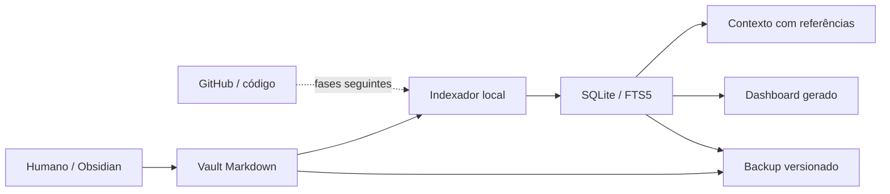

# Fluxos

```mermaid
flowchart LR
 H[Humano / Obsidian] --> V[Vault Markdown]
 V --> I[Indexador local]
 I --> S[SQLite / FTS5]
 S --> C[Contexto com referências]
 S --> D[Dashboard gerado]
 V --> B[Backup versionado]
 S --> B
 G[GitHub / código] -. fases seguintes .-> I
```

Nada é enviado ao Firebase ou a um provedor de IA pelo Omega na fase 1. SQLite não substitui Markdown. Conteúdo recuperado não é executado.
